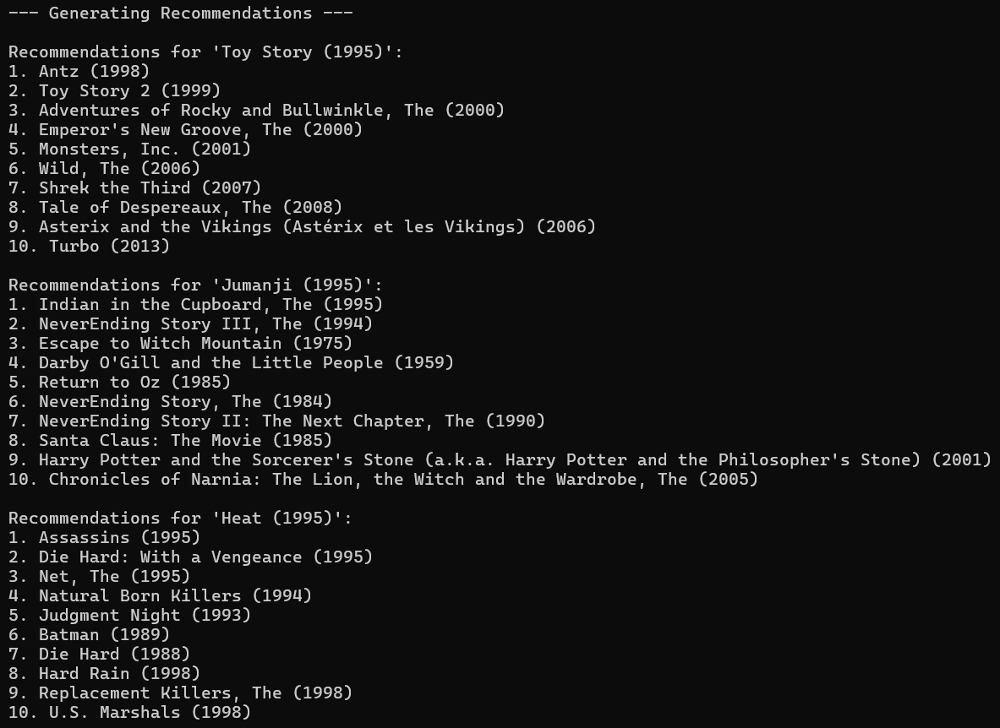

# Movie Recommendation System 🎬
**Machine Learning Internship - Task 4**

This project is a Content-Based Recommendation System built using Python, Scikit-learn, and the MovieLens dataset. It implements **TF-IDF Vectorization** and **Cosine Similarity** to suggest movies based on genre similarity.

## 📝 Project Description
The goal of this project is to build a recommendation engine that suggests movies to users based on the metadata (genres) of their favorite films. Unlike collaborative filtering which relies on user ratings, this content-based approach analyzes the actual attributes of the movies to find mathematical matches.

### Key Logic:
1.  **Text Preprocessing:** The system processes the 'Genres' column from the dataset.
2.  **TF-IDF Vectorization:** Converts genre text into numerical vectors, giving importance to specific genre tags.
3.  **Cosine Similarity:** Calculates the angular distance between movie vectors to identify the most similar films.

## 🚀 Features
- **Data Cleaning:** Handles missing values and prepares the MovieLens dataset for analysis.
- **Content-Based Filtering:** Suggests movies similar to a user-provided title (Item-Item Similarity).
- **Qualitative Evaluation:** Generates top-10 recommendation lists for sample inputs.

## 🛠️ Tech Stack
- **Python** (Core Logic)
- **Pandas** (Data Manipulation)
- **Scikit-learn** (TF-IDF & Cosine Similarity)

## 📂 Dataset
This project uses the **MovieLens Latest Small Dataset**.
1.  Download the dataset from [MovieLens](https://grouplens.org/datasets/movielens/latest/).
2.  Extract the `ml-latest-small.zip` file.
3.  Place `movies.csv` and `ratings.csv` in the root directory of this project.

## 🏃‍♂️ How to Run
1.  Clone this repository:
    ```bash
    git clone [https://github.com/YourUsername/Syntecxhub_Task4_Movie_Recommender.git](https://github.com/YourUsername/Syntecxhub_Task4_Movie_Recommender.git)
    ```
2.  Install the required libraries:
    ```bash
    pip install pandas scikit-learn
    ```
3.  Run the script:
    ```bash
    python movie_recommender.py
    ```

## 📊 Project Output
Below is the qualitative evaluation of the model, showing recommendations for *Toy Story*, *Jumanji*, and *Heat*.



---
**Completed by:** [Your Name]
**Internship:** Machine Learning Intern at Syntecxhub
